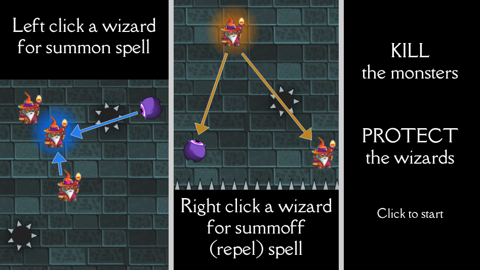

# Summon & Summoff

This repo contains our submission for the Ludum Dare 55 Competition.

You control the wizards. Your goal is to survive as long as you can, and kill as many monsters as you can. When a monster touches a wizard, the wizard dies. Spikes kill wizards and monsters.

Left click a wizard to activate the “summon” spell - everything else is attractted to you.

Right click a wizard to activate the “summ-off” spell - everything else is repelled from you.

Good luck!

## How to run locally

```bash
npm install     # install dependencies
npm run please  # compile typescript and run local webserver
```

## Image sources

- https://craftpix.net/freebies/wizard-character-free-sprite
- https://www.gameartguppy.com/shop/monster-pack-01/
- https://pucci-games.itch.io/stones-brick-textures
